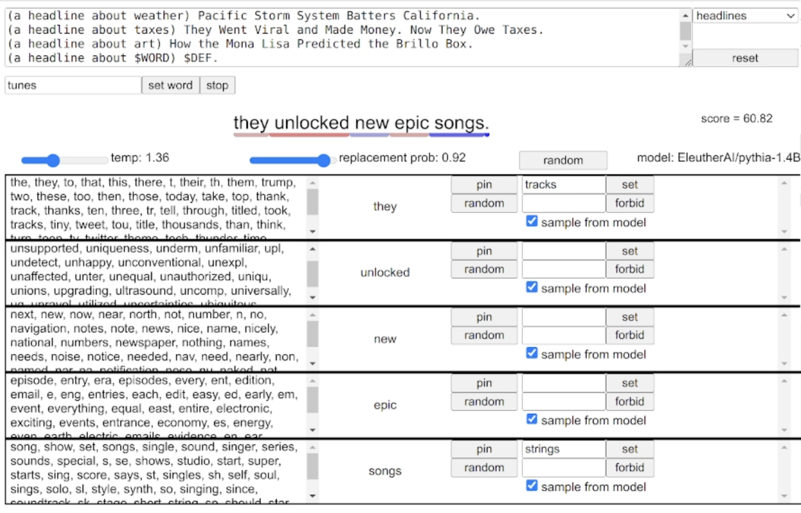

# Acronymy Assistant

Acronymy Assistant is an interactive tool for composing backronyms.

It was created as an attempt to speed up progress on https://acronymy.net/ .

Here is what it looks like:



And here is a quick video explanation of how it works:

[](http://youtu.be/LjOHnXRIp4Y)


## Features

### prompt
Choose a prompt template and edit it to your liking. `$WORD` will get replaced
by the current word, and `$DEF` will get replaced by the definition.
If there is no `$DEF`, then the definition will be added at the end of the prompt.

### temperature
Higher temperature flattens the probability distributions, i.e. makes
Acronymy Assistant more likely to choose weirder tokens.

### replacement_prob

At each iteration, Acronymy Assistant resamples a random subset
of the current definition's words. For each word, replacement_prob is
the probability that it will be replace on a given iteration.

### Sample from model
If the "sample from model" checkbox is checked for a word, then tokens
for that word are chosen from the neural network model.
Otherwise, the word is resample uniformly from the
word list (by default wordlist.asc).
Uniform sampling is kind of like setting the temerature
infinitely high, but is additionally constrained to only choose words
in the word list.


## How to run

Set up a virtual environment:

```
virtualenv venv
source venv/bin/activate

```

Download the dependecies:

```
pip install aiohttp
pip install 'transformers[torch]'
```

Start the server:
```
python server.py
```

Then point a web browser to http://localhost:8080/index.html .

To see commandline options (e.g. specifying which model to use), do this:
```
python server.py --help
```
